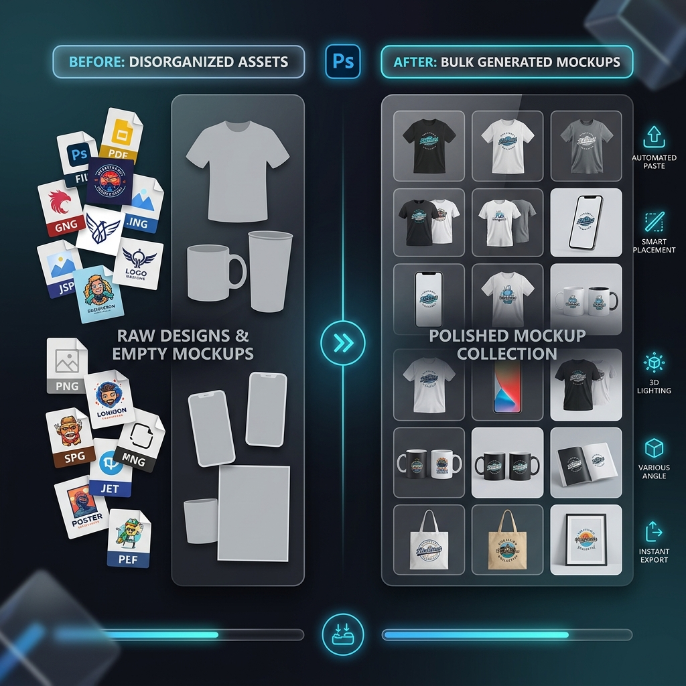

  
  
  <h1>🖼️ ps-bulk-mockups-filler</h1>
  
<b>Автоматизация процесса создания мокапов в Photoshop с помощью скрипта для массового заполнения.</b>

  
  

    <a href="#описание">Описание</a> •
    <a href="#возможности">Возможности</a> •
    <a href="#использование">Использование</a>
  

---

## 💡 Описание
**Bulk Mockups Filler** — это плагин/скрипт (ExtendScript) для Adobe Photoshop, разработанный для автоматизации монотонного процесса вставки множества дизайнов в смарт-объекты мокапов. Забудьте о ручной работе: просто укажите папки с исходниками, и скрипт сделает все сам!

## 🚀 Возможности
- 📦 **Пакетная обработка**: Автоматическая вставка папки с дизайнами в папку с мокапами.
- 📐 **Авто-масштабирование и выравнивание**: Различные опции подгонки (Fit, Fill, Stretch, Custom) ваших дизайнов под размер смарт-объектов с возможностью настройки выравнивания.
- 💾 **Гибкий экспорт**: Прямой экспорт результатов в форматы PSD, JPG или WEBP.
- 📁 **Кастомный нейминг и структура**: Удобная организация выходных файлов по типам или именам дизайнов, настройка префиксов и суффиксов.
- 🔄 **Множественные смарт-объекты**: Поддержка мокапов с несколькими смарт-объектами внутри одного файла.

## 💻 Использование
1. Откройте Adobe Photoshop.
2. Перейдите в меню `Файл > Сценарии > Обзор...` (`File > Scripts > Browse...`).
3. Выберите файл `BulkMockupsFiller.jsx`.
4. В появившемся UI окне:
   - Укажите папку, содержащую ваши мокапы (PSD/PSB).
   - Укажите папку с вашими дизайнами (PNG/JPG/PSD/и т.д.).
   - Выберите папку для сохранения готовых файлов (Output).
   - Настройте имя целевого слоя (по умолчанию `Design`), если ваши смарт-объекты называются иначе.
   - Нажмите "Запустить" и наслаждайтесь магией!
